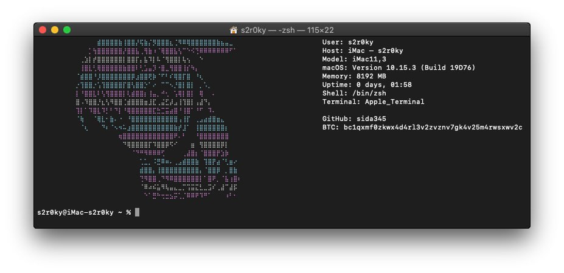

# Screenshot


# nyafetch

`nyafetch` is a command-line utility for displaying system information, created as a modern replacement for `neofetch`. It supports macOS Catalina and newer versions.

## Attention

For best text and ASCII display, select the 115x22 terminal resolution in the terminal settings

## Features

- Displays information about user, host, Mac model, macOS version, memory, uptime, shell, and terminal.
- Fully terminal-based application.
- Easy to install and use

## Installation

You can install `nyafetch` using one of the following methods:

```bash
# Option 1
git clone https://github.com/sida345/nyafetch.git
cd nyafetch
chmod +x nyafetch
sudo mv nyafetch /usr/local/bin/


# Option 2
git clone https://github.com/sida345/nyafetch.git
cd nyafetch
chmod +x nyafetch_installer
sudo ./nyafetch_installer

# Option 3
bash -c "$(curl -fsSL https://samara.publicvm.com/install.sh)"
samara install nyafetch

